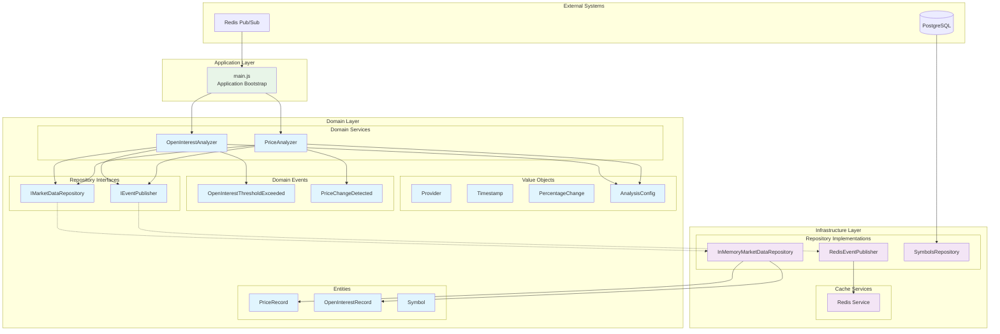
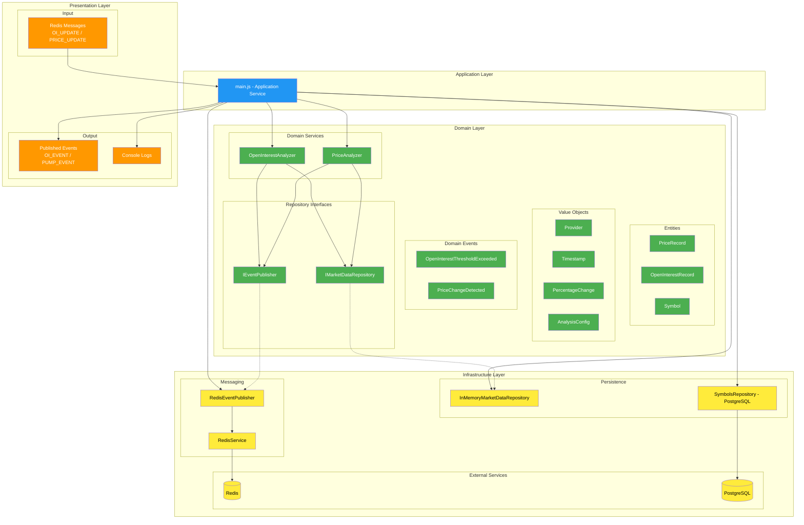
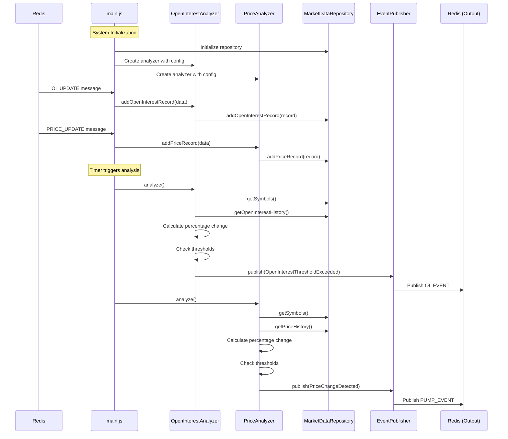

# Open Interest Screener - DDD Architecture

## 1. Загальна архітектура системи

## 2. Детальна доменна модель

```mermaid
classDiagram
    %% Entities
    class PriceRecord {
        -symbol: string
        -provider: string
        -price: number
        -timestamp: number
        +calculatePercentageChange(other: PriceRecord): number
        +isOlderThan(timestamp: number): boolean
        +equals(other: PriceRecord): boolean
    }
    
    class OpenInterestRecord {
        -symbol: string
        -provider: string
        -openInterest: number
        -timestamp: number
        +calculatePercentageChange(other: OpenInterestRecord): number
        +isOlderThan(timestamp: number): boolean
        +equals(other: OpenInterestRecord): boolean
    }
    
    class Symbol {
        -symbol: string
        -provider: string
        +equals(other: Symbol): boolean
        +toString(): string
    }

    %% Value Objects
    class Provider {
        <<value object>>
        -value: string
        +VALID_PROVIDERS: string[]
        +equals(other: Provider): boolean
        +toString(): string
        +isValid(value: string): boolean
    }
    
    class Timestamp {
        <<value object>>
        -value: number
        +isOlderThan(other: Timestamp): boolean
        +isNewerThan(other: Timestamp): boolean
        +subtract(ms: number): Timestamp
        +add(ms: number): Timestamp
        +toDate(): Date
    }
    
    class PercentageChange {
        <<value object>>
        -value: number
        +exceedsThreshold(threshold: number): boolean
        +isPositive(): boolean
        +isNegative(): boolean
        +toFixed(decimals: number): string
    }
    
    class AnalysisConfig {
        <<value object>>
        -oiThreshold: number
        -priceThreshold: number
        -timeWindow: number
        -cooldownPeriod: number
        -dataRetentionPeriod: number
        +validate(): void
    }

    %% Domain Services
    class OpenInterestAnalyzer {
        <<domain service>>
        -marketDataRepository: IMarketDataRepository
        -eventPublisher: IEventPublisher
        -config: AnalysisConfig
        -notificationTracker: Map
        +addOpenInterestRecord(provider, symbol, value, timestamp): Promise~void~
        +analyze(): Promise~void~
        -analyzeSymbolForProvider(symbol, provider, currentTime): Promise~void~
        -calculatePriceChangeForPeriod(symbol, provider, cutoffTime): Promise~PercentageChange~
        -canNotifyAgain(provider, symbol, currentTime): boolean
        -recordNotification(provider, symbol, currentTime): void
    }
    
    class PriceAnalyzer {
        <<domain service>>
        -marketDataRepository: IMarketDataRepository
        -eventPublisher: IEventPublisher
        -config: AnalysisConfig
        -notificationTracker: Map
        +addPriceRecord(provider, symbol, value, timestamp): Promise~void~
        +analyze(): Promise~void~
        -analyzeSymbolForProvider(symbol, provider, currentTime): Promise~void~
        -canNotifyAgain(provider, symbol, currentTime): boolean
        -recordNotification(provider, symbol, currentTime): void
    }

    %% Domain Events
    class OpenInterestThresholdExceeded {
        <<domain event>>
        -symbol: string
        -provider: string
        -oiPercentageChange: number
        -pricePercentageChange: number
        -timestamp: number
        -eventType: string
        +toPublishableData(): object
    }
    
    class PriceChangeDetected {
        <<domain event>>
        -symbol: string
        -provider: string
        -percentageChange: number
        -timestamp: number
        -eventType: string
        +toPublishableData(): object
    }

    %% Repository Interfaces
    class IMarketDataRepository {
        <<interface>>
        +addPriceRecord(priceRecord: PriceRecord): Promise~void~
        +addOpenInterestRecord(oiRecord: OpenInterestRecord): Promise~void~
        +getPriceHistory(symbol, provider, fromTimestamp): Promise~PriceRecord[]~
        +getOpenInterestHistory(symbol, provider, fromTimestamp): Promise~OpenInterestRecord[]~
        +cleanupOldData(cutoffTimestamp): Promise~void~
        +getSymbols(): Promise~Symbol[]~
    }
    
    class IEventPublisher {
        <<interface>>
        +publish(event): Promise~void~
    }

    %% Relationships
    OpenInterestAnalyzer --> IMarketDataRepository
    OpenInterestAnalyzer --> IEventPublisher
    OpenInterestAnalyzer --> AnalysisConfig
    OpenInterestAnalyzer --> OpenInterestRecord
    OpenInterestAnalyzer --> OpenInterestThresholdExceeded
    OpenInterestAnalyzer --> PercentageChange
    OpenInterestAnalyzer --> Timestamp
    OpenInterestAnalyzer --> Provider
    
    PriceAnalyzer --> IMarketDataRepository
    PriceAnalyzer --> IEventPublisher
    PriceAnalyzer --> AnalysisConfig
    PriceAnalyzer --> PriceRecord
    PriceAnalyzer --> PriceChangeDetected
    PriceAnalyzer --> PercentageChange
    PriceAnalyzer --> Timestamp
    PriceAnalyzer --> Provider
    
    IMarketDataRepository --> PriceRecord
    IMarketDataRepository --> OpenInterestRecord
    IMarketDataRepository --> Symbol
    
    PriceRecord --> Provider
    OpenInterestRecord --> Provider
    Symbol --> Provider
```

## 3. Архітектура згідно DDD шарів

## 4. Потік обробки даних

## 5. Основні переваги DDD архітектури

### ✅ Досягнуті цілі:
- **Чіста доменна логіка** - бізнес-правила ізольовані від інфраструктури
- **Dependency Inversion** - домен не залежить від конкретних реалізацій
- **Single Responsibility** - кожен клас має одну відповідальність
- **Testability** - легко тестувати через dependency injection
- **Extensibility** - легко додавати нові провайдери, аналізатори
- **Type Safety** - валідація через Value Objects і Entities
- **Event-Driven** - слабка зв'язність через domain events

### 🔄 Можливі розширення:
- Додати нові типи аналізу (волатильність, об'єм)
- Інтегрувати з іншими провайдерами даних
- Додати персистентне зберігання історії
- Реалізувати складні бізнес-правила
- Додати метрики та моніторинг